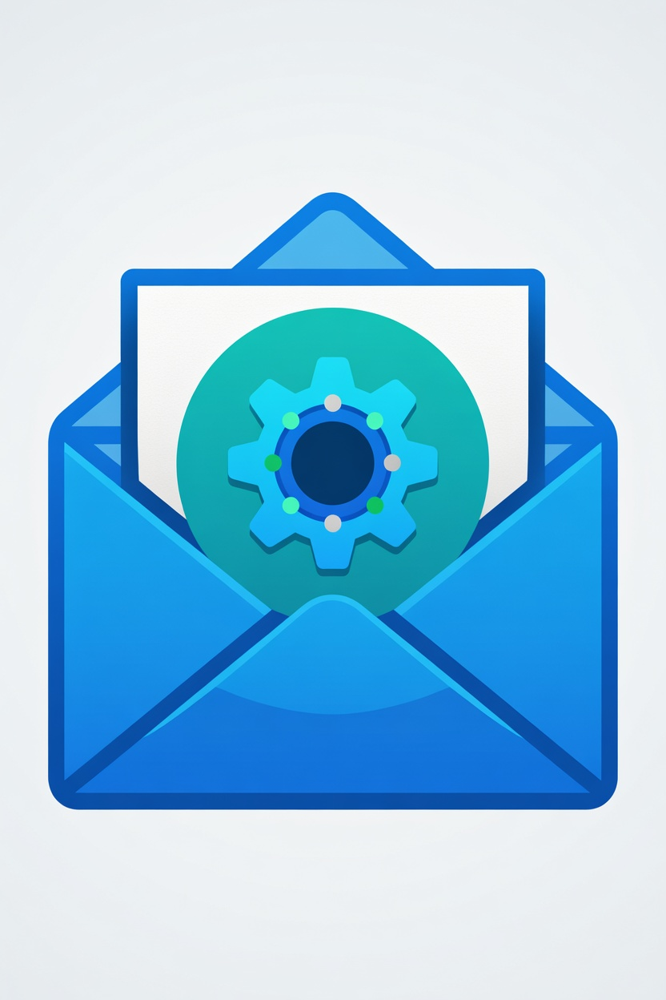

# Email Cleaner

A local desktop web app to bulk-clean Yahoo and Gmail inboxes.
Connect your accounts, scan thousands of emails, and delete spam senders in bulk — all from your browser, running privately on your own PC.



---

## Features

- **Yahoo Mail** — connect with an App Password (no developer account needed)
- **Gmail** — connect via OAuth (free Google Cloud project)
- **Grouped sender view** — see how many emails each sender has sent, sort by count/domain/date
- **Bulk delete** — select all from a sender and delete from the server in one click
- **Report Spam** — move emails to your Spam/Junk folder on the server
- **Whitelist / Exclude** — permanently exclude senders, or hide them for the current session only
- **Unsubscribe** — auto-sends the List-Unsubscribe request for newsletters
- **DNSBL spam check** — optional DNS blocklist scan against public spam databases
- **CSV export** — download your flagged senders as a spreadsheet
- **5 color themes** — Light, Dark, Ocean, Sunset, Forest
- **Search** — find all emails from any address or domain across your inbox

---

## Requirements

- [Node.js 18+](https://nodejs.org)
- A Yahoo or Gmail account

---

## Quick Start

### 1. Download

Click **Releases** on the right → download `email-cleaner-v1.0.zip` → extract it anywhere.

### 2. Install dependencies

Open a terminal in the extracted folder:

```bash
npm install
cd backend && npm install
cd ../frontend && npm install
```

### 3. Configure

```bash
cp backend/.env.example backend/.env
```

Open `backend/.env` in any text editor. The defaults work for Yahoo. For Gmail, follow the OAuth setup instructions below.

### 4. Start the app

Open **two** terminals:

**Terminal 1 — Backend:**
```bash
cd backend
npm run dev
```
Wait for: `Server running on port 3001`

**Terminal 2 — Frontend:**
```bash
cd frontend
npm run dev
```

Then open **http://localhost:5173** in your browser.

---

## Connecting Yahoo Mail

1. Go to Yahoo → Account Security → **Generate app password**
2. Select "Other app" → name it `Email Cleaner` → click Generate
3. Copy the 16-character code
4. In Email Cleaner → **Settings** → Add Yahoo Account → paste the code

> If you don't see "Generate app password", enable 2-Step Verification first.

---

## Connecting Gmail

Gmail requires a free Google Cloud project (one-time, ~5 minutes):

1. Go to [console.cloud.google.com](https://console.cloud.google.com) → New Project → name it `Email Cleaner`
2. Enable the **Gmail API** (APIs & Services → Library → search Gmail API)
3. Create OAuth credentials (APIs & Services → Credentials → Create → OAuth client ID → Web application)
4. Add redirect URI: `http://localhost:3001/auth/gmail/callback`
5. Download the credentials JSON → rename to `credentials.json` → place in the `backend/` folder
6. In Email Cleaner → Settings → **Connect Gmail**

Full instructions in [OAUTH_SETUP.md](OAUTH_SETUP.md).

---

## Access from phone or tablet

1. Run `ipconfig` in terminal → find your IPv4 address (e.g. `192.168.1.50`)
2. On your phone: `http://192.168.1.50:5173`
3. Both devices must be on the same Wi-Fi

---

## Project structure

```
backend/src/
  routes/         email, accounts, auth, whitelist API endpoints
  services/       IMAP (Gmail + Yahoo), filter rules, sync, DNSBL
  db/             SQLite database + TypeScript models

frontend/src/
  pages/          Inbox, Search, Settings, Help
  App.tsx         Navigation shell + theme system
  api.ts          All API calls
```

---

## Support development

If Email Cleaner saves you time, consider supporting it:

[](https://ko-fi.com/YOUR_KOFI_USERNAME)

---

## License

MIT — free to use, modify, and distribute.
